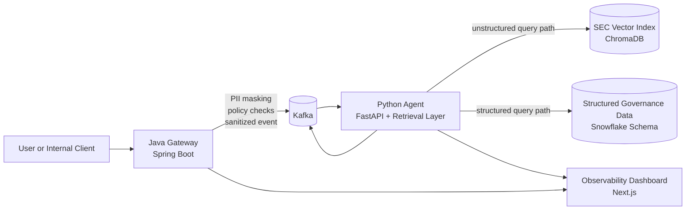

# Guardian-Stream

Guardian-Stream is a security-first AI governance platform for enterprise Retrieval Augmented Generation. The project is designed around a simple idea: sensitive prompts should not flow directly into an LLM pipeline without enforcement, auditability, and routing controls.

The system splits responsibilities across a Java gateway and a Python agent layer. The gateway acts as a semantic firewall for prompt ingress, while the agent handles retrieval, orchestration, and grounded response generation across structured and unstructured data sources.

## Why I Built This
I wanted to build a project that reflects how real enterprise AI systems need to work, not just how demos work.

Most AI prototypes focus on model output, but production systems are usually constrained by different problems:
- prompts may contain PII or regulated content
- users should not see data outside their clearance level
- unstructured and structured data need different retrieval strategies
- auditability matters as much as answer quality
- systems need to scale under event-driven traffic, not just in notebooks

Guardian-Stream is my attempt to model that reality. Instead of treating AI as a single app call, this project treats it as a governed distributed system.

## Use Case
The target use case is an internal enterprise assistant that answers questions over:
- sensitive corporate documents
- financial filings and long-form text
- internal structured metadata such as employee access, projects, and security policies

Example questions this system is meant to support:
- "What does Microsoft say about cloud growth and Azure in recent filings?"
- "Which employees are cleared for Project Redwood?"
- "Should this prompt be blocked, masked, or allowed based on policy?"

The system is designed to answer those questions while preserving security boundaries and producing observable traces.

## Why It Matters
Enterprise AI systems are only useful if they are also trustworthy. That means:
- sensitive data should be redacted before downstream processing
- policy checks should happen before retrieval
- source evidence should be visible in responses
- blocked actions should be logged and explainable
- latency and scale should be measurable

Guardian-Stream is important as a project because it combines application engineering, distributed systems, retrieval, and governance in one architecture.

## Architecture


## Core Design
### Java Gateway
The gateway is the first trust boundary.

Responsibilities:
- receive prompts
- sanitize structured PII such as emails, SSNs, and card-like patterns
- apply policy hooks and project-level access checks
- publish sanitized events to Kafka

Why Java here:
- predictable performance
- strong fit for high-concurrency service workloads
- clear separation between enforcement and reasoning

### Python Agent
The agent is the cognitive layer.

Responsibilities:
- consume sanitized prompt events
- route between structured and unstructured retrieval paths
- retrieve SEC filing context from a local index
- evolve toward LangGraph-based multi-step reasoning
- produce grounded answers with source traces

Why Python here:
- stronger ecosystem for retrieval, NLP, and agent orchestration
- easier integration with RAG frameworks and evaluation tooling

## Tech Stack
### Backend
- `Java 21`
- `Spring Boot`
- `Spring Kafka`
- `Python 3.11/3.12-compatible`
- `FastAPI`
- `kafka-python`

### Retrieval and Data
- `ChromaDB` for local SEC retrieval indexing
- `BeautifulSoup` for SEC HTML preprocessing
- `sec-downloader` for EDGAR ingestion
- `Snowflake SQL` schema for structured governance data

### Infra
- `Docker Compose` for local vertical-slice development
- `Kafka` for event transport
- `Kubernetes` and `KEDA` planned for scale-out deployment

### Frontend
- `Next.js` planned for the observability dashboard

## Data Strategy
Guardian-Stream uses both unstructured and structured datasets.

### Unstructured
- `SEC EDGAR filings`
  - downloaded into `data/raw/sec/`
  - processed into retrieval chunks under `data/processed/sec/`
  - indexed locally under `data/indexes/sec/`

- `Enron email corpus`
  - stored under `data/raw/enron/`
  - intended for PII masking evaluation and prompt realism

### Security Test Vectors
- `JailbreakBench`
  - stored under `data/test_vectors/jailbreakbench/`
  - intended for prompt attack and guardrail testing

### Structured Governance Data
- synthetic Snowflake-oriented data under `infra/snowflake/sql/`
- includes:
  - departments
  - employees
  - project access mappings
  - security policies
  - audit logs
  - request metrics

## Current Repository Layout
```text
guardian-stream/
├── gateway/          # Spring Boot gateway and Kafka producer
├── agent/            # FastAPI agent, SEC retrieval, ingestion scripts
├── dashboard/        # Planned observability UI
├── infra/            # Docker Compose, K8s, Snowflake SQL
├── shared/           # Shared message contracts
├── data/             # Local corpora, processed chunks, indexes, test vectors
└── docs/             # Architecture notes and supporting docs
```

## What’s Implemented Right Now
The repo already contains a working local data and retrieval foundation.

Implemented:
- Spring Boot gateway skeleton with prompt ingestion and sanitization
- Python agent skeleton with Kafka consumer and retrieval workflow
- SEC filing download pipeline
- SEC HTML preprocessing pipeline
- local SEC chunk index in ChromaDB
- grounded SEC retrieval responses with citations
- Snowflake schema and synthetic seed data for governance use cases

Still evolving:
- richer structured-query routing
- true SQL execution path for the Snowflake side
- stronger answer synthesis
- dashboard implementation
- production deployment and autoscaling

## End-to-End Flow
### Phase 1 Vertical Slice
1. a user sends a prompt to the Java gateway
2. the gateway masks structured PII and applies policy checks
3. the gateway emits a sanitized event to Kafka
4. the Python agent consumes the event
5. the agent retrieves relevant SEC or structured governance context
6. the system returns a grounded, traceable response

## Local Data and Retrieval Workflow
### SEC Ingestion
Download SEC filings with:

```bash
cd agent
python scripts/download_sec_filings.py
```

### SEC Preprocessing
Convert raw SEC HTML into chunked JSONL:

```bash
cd agent
python scripts/process_sec_filings.py
```

### Build the Local SEC Index
Create the ChromaDB index:

```bash
cd agent
python scripts/build_sec_index.py --recreate
```

### Query the SEC Index
Run a local retrieval query:

```bash
cd agent
python scripts/query_sec_index.py "What does Microsoft say about cloud growth and Azure?"
```

## Structured Governance Model
The Snowflake SQL assets are designed to support:
- RBAC and project clearance lookups
- prompt-time keyword and clearance enforcement
- audit logging for sanitized and blocked requests
- latency and request metrics for observability

The main SQL files are:
- [001_schema.sql](/Users/chetan/Guardian-Stream/infra/snowflake/sql/001_schema.sql:1)
- [002_seed_data.sql](/Users/chetan/Guardian-Stream/infra/snowflake/sql/002_seed_data.sql:1)
- [003_example_queries.sql](/Users/chetan/Guardian-Stream/infra/snowflake/sql/003_example_queries.sql:1)

## MVP Goal
The MVP is not “a chatbot.” The MVP is a governed AI request path:
- secure ingress
- deterministic sanitization
- event-driven processing
- grounded retrieval
- structured policy context
- auditable behavior

That is the system slice this project is trying to prove first.

## Roadmap
### Near Term
- improve retrieval quality and chunking
- add structured query routing for Snowflake-style questions
- connect the agent workflow to structured governance lookups
- add policy evaluation tests using JailbreakBench and Enron prompts

### Later
- add LangGraph orchestration
- add dashboard views for latency, blocked prompts, and reasoning traces
- deploy with Kubernetes and KEDA
- introduce production-grade vector backends such as Milvus or Pinecone

## Getting Started
The repo blueprint is captured in [build-plan.md](/Users/chetan/Guardian-Stream/build-plan.md:1), and the architectural notes live in [docs/architecture.md](/Users/chetan/Guardian-Stream/docs/architecture.md:1).

If you want to explore the current implementation quickly, the best entry points are:
- [gateway/README.md](/Users/chetan/Guardian-Stream/gateway/README.md:1)
- [agent/README.md](/Users/chetan/Guardian-Stream/agent/README.md:1)
- [data/README.md](/Users/chetan/Guardian-Stream/data/README.md:1)
- [infra/snowflake/README.md](/Users/chetan/Guardian-Stream/infra/snowflake/README.md:1)
