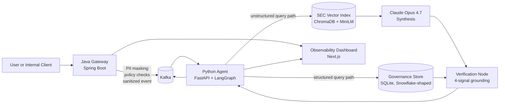

# Guardian-Stream

Guardian-Stream is a security-first AI governance platform for enterprise Retrieval Augmented Generation. The project is designed around a simple idea: sensitive prompts should not flow directly into an LLM pipeline without enforcement, auditability, and routing controls.

The system splits responsibilities across a Java gateway and a Python agent layer. The gateway acts as a semantic firewall for prompt ingress, while the agent handles retrieval, orchestration, and grounded response generation across structured and unstructured data sources.

## Why I Built This
I wanted to build a project that reflects how real enterprise AI systems need to work, not just how demos work.

Most AI prototypes focus on model output, but production systems are usually constrained by different problems:
- prompts may contain PII or regulated content
- users should not see data outside their clearance level
- unstructured and structured data need different retrieval strategies
- auditability matters as much as answer quality
- systems need to scale under event-driven traffic, not just in notebooks

Guardian-Stream is my attempt to model that reality. Instead of treating AI as a single app call, this project treats it as a governed distributed system.

## Use Case
The target use case is an internal enterprise assistant that answers questions over:
- sensitive corporate documents
- financial filings and long-form text
- internal structured metadata such as employee access, projects, and security policies

Example questions this system is meant to support:
- "What does Microsoft say about cloud growth and Azure in recent filings?"
- "Which employees are cleared for Project Redwood?"
- "Should this prompt be blocked, masked, or allowed based on policy?"

The system is designed to answer those questions while preserving security boundaries and producing observable traces.

## Why It Matters
Enterprise AI systems are only useful if they are also trustworthy. That means:
- sensitive data should be redacted before downstream processing
- policy checks should happen before retrieval
- source evidence should be visible in responses
- blocked actions should be logged and explainable
- latency and scale should be measurable

Guardian-Stream is important as a project because it combines application engineering, distributed systems, retrieval, and governance in one architecture.

## Architecture


The agent is a 5-node LangGraph workflow: a router selects a path, a retrieval node loads evidence, a synthesis node calls Claude Opus 4.7 over the retrieved chunks (SEC path only), and a verification node scores the response on four independent signals before it leaves the system.

## Core Design
### Java Gateway
The gateway is the first trust boundary.

Responsibilities:
- receive prompts
- sanitize structured PII such as emails, SSNs, and card-like patterns
- apply policy hooks and project-level access checks
- publish sanitized events to Kafka

Why Java here:
- predictable performance
- strong fit for high-concurrency service workloads
- clear separation between enforcement and reasoning

### Python Agent
The agent is the cognitive layer, built as a 5-node LangGraph workflow.

Nodes:
- `router` — token-overlap heuristic that picks the structured or unstructured path
- `structured_response` — SQL queries against the SQLite governance store
- `sec_response` — semantic retrieval over the Chroma vector index (`all-MiniLM-L6-v2`, cosine, top-3 with token-overlap reranking)
- `synthesize_response` — Claude Opus 4.7 call over the retrieved chunks, with prompt caching on the system prompt and a strict citation contract; refusals are surfaced explicitly so the fallback template never masks them
- `verify_response` — multi-signal grounding gate that runs on every response

Why Python here:
- stronger ecosystem for retrieval, NLP, and agent orchestration
- easier integration with RAG frameworks and evaluation tooling

### Verification Node
Every response — synthesized or templated — passes through a verifier that checks four independent signals:

1. **Citation coverage** — every `[chunk_id]` cited in the answer must resolve to a source returned by retrieval (≥ 0.99).
2. **Prompt–evidence token overlap** — content tokens from the prompt must overlap evidence at ≥ 0.20, with company-alias expansion (`msft` ↔ `microsoft`, `aapl` ↔ `apple`).
3. **Proper-noun grounding** — capitalized non-sentence-start tokens in the prompt must appear in the retrieved evidence (with the same alias expansion).
4. **Cosine-distance gate** — the best retrieved chunk must be within `0.60` of the query vector; anything looser is treated as off-corpus.

The verifier emits a structured verdict (`verified`, `support_score`, `citation_coverage`, `evidence_count`, notes) attached to every `AgentResponse`, giving downstream consumers an audit-grade signal in addition to the answer text.

## Tech Stack
### Backend
- `Java 21`, `Spring Boot`, `Spring Kafka`
- `Python 3.11/3.12-compatible`, `FastAPI`, `kafka-python`
- `LangChain` + `LangGraph` for the agent state machine
- `Anthropic SDK` + `Claude Opus 4.7` for grounded answer synthesis with prompt caching

### Retrieval and Data
- `ChromaDB` with `sentence-transformers/all-MiniLM-L6-v2` (384-dim, cosine) for SEC retrieval
- `BeautifulSoup` for SEC HTML preprocessing, `sec-downloader` for EDGAR ingestion
- `SQLite` governance store with ANSI-SQL queries — schema mirrors the future Snowflake target so migration is a connection swap

### Infra
- `Docker Compose` for local vertical-slice development
- `Kafka` for event transport
- `Kubernetes` manifests + Kustomize entrypoint for the agent and gateway
- `KEDA ScaledObject` autoscaling the agent on Kafka consumer lag

### Quality
- `pytest` for unit + store tests (31 tests, ~80 ms)
- `ruff` lint + format
- GitHub Actions CI: ruff + pytest on agent changes, `kubeconform` on manifest changes
- Two custom eval harnesses: a 25-prompt accuracy/grounding eval and a 40-prompt adversarial benchmark

### Frontend
- `Next.js` planned for the observability dashboard

## Data Strategy
Guardian-Stream uses both unstructured and structured datasets.

### Unstructured
- `SEC EDGAR filings`
  - downloaded into `data/raw/sec/`
  - processed into retrieval chunks under `data/processed/sec/`
  - indexed locally under `data/indexes/sec/`

- `Enron email corpus`
  - stored under `data/raw/enron/`
  - intended for PII masking evaluation and prompt realism

### Security Test Vectors
- `JailbreakBench`
  - stored under `data/test_vectors/jailbreakbench/`
  - intended for prompt attack and guardrail testing

### Structured Governance Data
- synthetic Snowflake-oriented data under `infra/snowflake/sql/`
- includes:
  - departments
  - employees
  - project access mappings
  - security policies
  - audit logs
  - request metrics

## Current Repository Layout
```text
guardian-stream/
├── gateway/          # Spring Boot gateway and Kafka producer
├── agent/            # FastAPI agent, SEC retrieval, ingestion scripts
├── dashboard/        # Planned observability UI
├── infra/            # Docker Compose, K8s, Snowflake SQL
├── shared/           # Shared message contracts
├── data/             # Local corpora, processed chunks, indexes, test vectors
└── docs/             # Architecture notes and supporting docs
```

## What's Implemented Right Now
The repo contains a working agent stack with retrieval, synthesis, verification, and end-to-end evaluation.

Implemented:
- Spring Boot gateway skeleton with prompt ingestion and sanitization
- Python LangGraph agent: router → structured/sec/mock → synthesis → verification → END
- 999-chunk Chroma index over Apple + Microsoft 10-K and 10-Q filings, MiniLM embeddings, cosine distance
- SEC ingestion + preprocessing pipeline
- Claude Opus 4.7 synthesis with prompt-cached system prompt and explicit refusal handling
- 4-signal verification node (citation coverage, prompt–evidence overlap, proper-noun grounding, distance gate)
- SQLite-backed governance store with parameterized ANSI-SQL queries (Snowflake-shaped)
- 25-prompt accuracy/grounding eval and 40-prompt adversarial benchmark
- 31-test pytest suite covering router, verifier, structured retrieval, and store
- Kubernetes manifests for agent + gateway with KEDA Kafka-lag autoscaling
- GitHub Actions CI (ruff lint + format, pytest, kubeconform on manifests)

Still evolving:
- dashboard implementation (Next.js scaffold present, not wired)
- live Snowflake connection (today's store is SQLite with the same query shape)
- gateway PII-redaction breadth (current rules cover structured PII; contextual NER not yet integrated)

## Evaluation
### Accuracy and Grounding (25-prompt eval)
| Metric | Value |
|---|---|
| Routing accuracy | 100% |
| Citation resolution | 100% |
| Structured-path verified | 100% (13/13) |
| Legitimate SEC verified | 100% (8/8) |
| P95 retrieval latency | ~45 ms |

Run with `python agent/scripts/run_eval.py`.

### Adversarial Defense (40-prompt benchmark, 6 categories)
| Metric | Value |
|---|---|
| Harm-prevention rate | **100%** (40/40) |
| Caught by verifier | 70% |
| Caught by router deflection | 18% |
| Caught by Claude refusal | 12% |

Categories: prompt injection, off-corpus probes, role-play bypass, authority override, data exfiltration, harmful content. Run with `python agent/scripts/run_adversarial_eval.py`.

### Tests
```bash
cd agent && pytest tests/ -v
# 31 passed in 0.08s
```

## End-to-End Flow
### Phase 1 Vertical Slice
1. a user sends a prompt to the Java gateway
2. the gateway masks structured PII and applies policy checks
3. the gateway emits a sanitized event to Kafka
4. the Python agent consumes the event
5. the agent retrieves relevant SEC or structured governance context
6. the system returns a grounded, traceable response

## Local Data and Retrieval Workflow
### SEC Ingestion
Download SEC filings with:

```bash
cd agent
python scripts/download_sec_filings.py
```

### SEC Preprocessing
Convert raw SEC HTML into chunked JSONL:

```bash
cd agent
python scripts/process_sec_filings.py
```

### Build the Local SEC Index
Create the ChromaDB index:

```bash
cd agent
python scripts/build_sec_index.py --recreate
```

### Query the SEC Index
Run a local retrieval query:

```bash
cd agent
python scripts/query_sec_index.py "What does Microsoft say about cloud growth and Azure?"
```

### Initialize the Governance Store
Bootstrap the SQLite governance database from the seed data:

```bash
cd agent
python scripts/init_governance_db.py --force
```

### Run the Evals
```bash
cd agent
python scripts/run_eval.py             # 25-prompt accuracy + grounding eval
python scripts/run_adversarial_eval.py # 40-prompt adversarial benchmark
```

The adversarial eval requires `ANTHROPIC_API_KEY` to test the synthesis layer; without it, the verifier and router still run and the deterministic fallback is exercised.

## Structured Governance Model
The Snowflake SQL assets are designed to support:
- RBAC and project clearance lookups
- prompt-time keyword and clearance enforcement
- audit logging for sanitized and blocked requests
- latency and request metrics for observability

The main SQL files are:
- [001_schema.sql](/Users/chetan/Guardian-Stream/infra/snowflake/sql/001_schema.sql:1)
- [002_seed_data.sql](/Users/chetan/Guardian-Stream/infra/snowflake/sql/002_seed_data.sql:1)
- [003_example_queries.sql](/Users/chetan/Guardian-Stream/infra/snowflake/sql/003_example_queries.sql:1)

## MVP Goal
The MVP is not “a chatbot.” The MVP is a governed AI request path:
- secure ingress
- deterministic sanitization
- event-driven processing
- grounded retrieval
- structured policy context
- auditable behavior

That is the system slice this project is trying to prove first.

## Roadmap
### Near Term
- wire the dashboard to the agent's reasoning trace and verification verdict
- swap the SQLite store for a real Snowflake connection (query shapes already match)
- broaden gateway PII coverage with contextual NER (spaCy / Presidio)

### Later
- introduce production-grade vector backends such as Milvus or Pinecone
- add per-tenant isolation and per-project clearance enforcement at the verifier layer
- expand the adversarial benchmark to include indirect prompt injection via poisoned retrievals

## Getting Started
The repo blueprint is captured in [build-plan.md](/Users/chetan/Guardian-Stream/build-plan.md:1), and the architectural notes live in [docs/architecture.md](/Users/chetan/Guardian-Stream/docs/architecture.md:1).

If you want to explore the current implementation quickly, the best entry points are:
- [gateway/README.md](/Users/chetan/Guardian-Stream/gateway/README.md:1)
- [agent/README.md](/Users/chetan/Guardian-Stream/agent/README.md:1)
- [data/README.md](/Users/chetan/Guardian-Stream/data/README.md:1)
- [infra/snowflake/README.md](/Users/chetan/Guardian-Stream/infra/snowflake/README.md:1)
